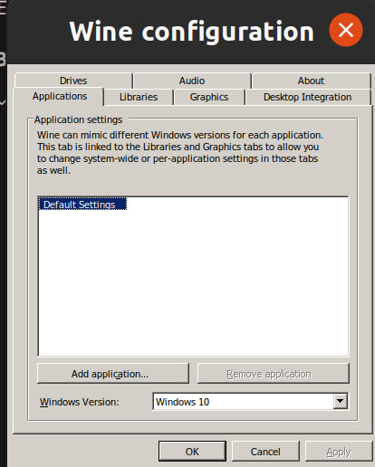
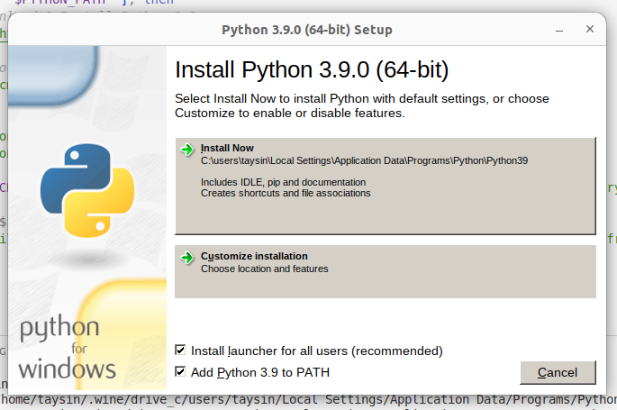

# 3D python

## Разработка

#### Для сборки проекта

Сначала нужно установить LFS (файлы с картами большие и лежат на гитлабе в виде LFS).

```bash
sudo apt-get install git-lfs
git lfs install
```

Нужно установить poetry (если его ещё нет) и выполнить из директории проекта:

```bash
poetry shell
poetry install
pre-commit install
```

#### Для запуска проекта

```bash
poetry run python -m mountain3d
```

И открыть в браузере http://127.0.0.1:8050/

#### Перед пушем в ветку

```bash
pre-commit run -a
```

## Использование

### Конфиги

#### РЛС (alarm)

#### ЗРК (fire)

#### UI

[Example](https://gitlab.com/ea_evdokimov/3d-python/-/blob/dev/3d-python-media/example_configs/ui_config.json)

- lat: float - Широта интересующей точки [-60, 60] - то есть от 60 градусов северной широты до 60 градусов южной широты (более полных карт в открытом доступе не найдено)

- long: float - Долгота интересующей точки [-180, 180]

- size_km: int - Размер отображаемой области (длина стороны квадрата с центром в точке (lat, long))

- map_size_px: Tuple[int, int] - Разрешение карты в пикселях

- cache: bool - Кэширование склеенных карт

### Сборка

```bash
./build_exe.sh
```
или
```bash
python setup_freeze.py build
```

После сборки появится директория build_executable, её нужно заархивировать.

N.B. Сборка не кроссплатформенная, то есть после сборки на устройстве с Linux исполняемый файл будет в формате elf, а на Windows - exe.

---
Сборка приложения под Windows на Linux-устройствах (реализовано через Wine):
```bash
./build_win.sh
```

#### Важно

* Выберите конфигурацию Wine под Windows 10 (в скрипте выставляется автоматически, возможно надо будет подтвердить в интерфейсе)

  
* Обязательно добавьте пакет с питоном в PATH (вторая галка сверху)

  

 ---

Для архивации под Linux нужно поставить zip (если он не стоит), под Windows можно собрать архив через проводник.

```bash
zip -r mountain3d.zip build_executable
```

Для использования приложения достаточно разархивировать пакет и запустить приложение mountain3d.exe.
